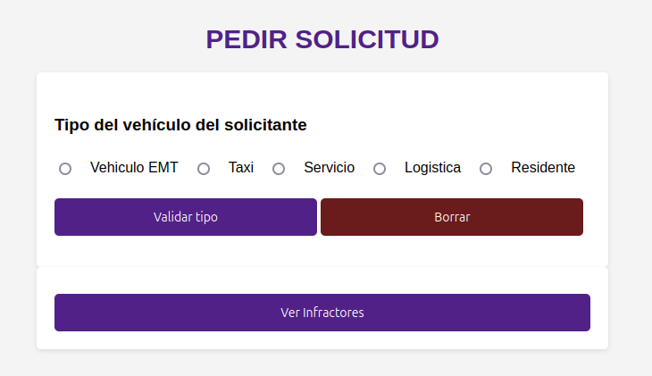
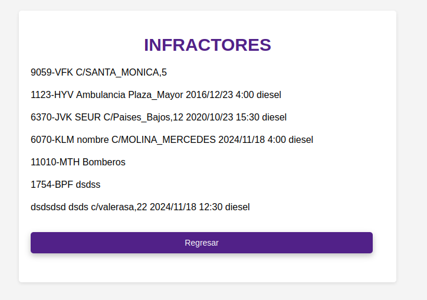
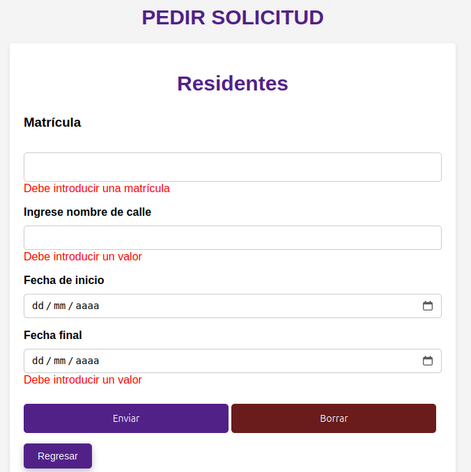

# 🚗 Proyecto: Gestión de Matrículas e Infractores

¡Bienvenido/a! Este repositorio contiene un sistema para gestionar **solicitudes de matrícula** y **verificar infracciones** de vehículos utilizando **PHP**, **HTML** y **CSS**. El sistema permite al usuario seleccionar el tipo de vehículo y verificar si hay infracciones basadas en una serie de condiciones.

---

### ✨ Descripción del Proyecto

**Gestión de Matrículas e Infractores** es una aplicación web que permite gestionar solicitudes de matrícula para diferentes tipos de vehículos y verificar infracciones de acuerdo con reglas específicas. La aplicación lee archivos de texto que contienen registros de vehículos y verifica si las matrículas han cometido infracciones basadas en la fecha, hora y tipo de vehículo.

- **Interactividad:** Formularios donde los usuarios pueden seleccionar el tipo de vehículo y consultar los infractores.
- **Verificación de Infracciones:** El sistema verifica si un vehículo ha cometido alguna infracción, como no ser eléctrico, o si no cumple con las restricciones de fecha y hora. Por ejemplo, los vehículos de logística solopodrán circular de 6 am a 10 am, en caso contrario serán infractores y serán añadidos al archivo de infrctores. Sin embargo; los vehiculos de servicios no tienen límite ninguno.
- **Diseño Visual:** Diseño claro y funcional que permite una fácil navegación entre formularios y resultados.

---

### 🛠️ Estructura del Proyecto

1. **`Formulario.html`**: Contiene el formulario interactivo donde el usuario selecciona el tipo de vehículo y puede solicitar la validación del tipo o consultar infractores.
2. **`AñadirMatricula.php`**: Maneja el proceso de agregar una matrícula de vehículo y valida los datos antes de almacenarlos.
3. **`movilidad.php`**: Verifica los vehículos infractores basándose en reglas de fecha y hora, mostrando los resultados de los vehículos que han cometido infracciones.
4. **`Style.css`**: Archivo de estilos que define el diseño visual de la aplicación web.

---

### 🚀 Ejecución del Proyecto

1. **Clonar el repositorio**:
   ```bash
   git clone https://github.com/DannaPatricia/practicaMovilidad.git
2. **Navegar al directorio del proyecto:**:
   ```bash
    cd practicaMovilidad
3. **Abrir el archivo html**:
   ```bash
    open Formulario.html
   
---

## 🎨 Capturas de Pantalla

 1. **Inicio**:
<div align = "center">
   
</div>
 2. **Listado de infractores**:
<div align = "center">
   
</div>
 3. **Formulario y repintado**:
<div align = "center">
   
</div>
---

## 🤝 Contribuciones

1. Haz un fork del repositorio.
2. Crea una rama para tu funcionalidad:
   ```bash
    git checkout -b mejora-nueva-funcion
3. Realiza los cambios y haz commmit:
   ```bash
   git commit -m "Añadida nueva función X"
4. Haz push a tu rama:
   ```bash
    git push origin mejora-nueva-funcion
5. Crea un pull request desde GitHub.


---

## 📜 Licencia

Este proyecto está bajo la **Licencia MIT**. Puedes ver el texto completo de la licencia a continuación:

---

¡Gracias por tu interés en este proyecto! 🚀

